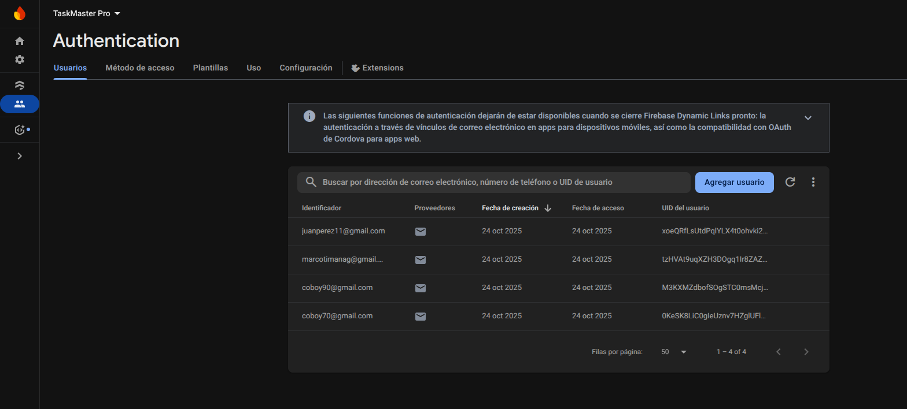
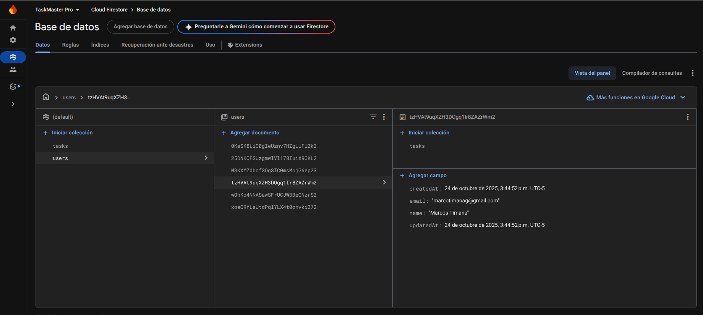
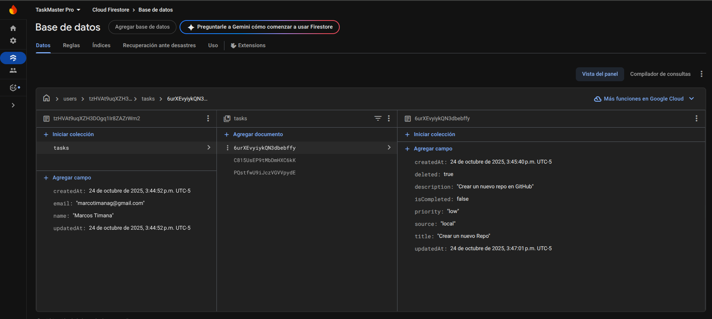
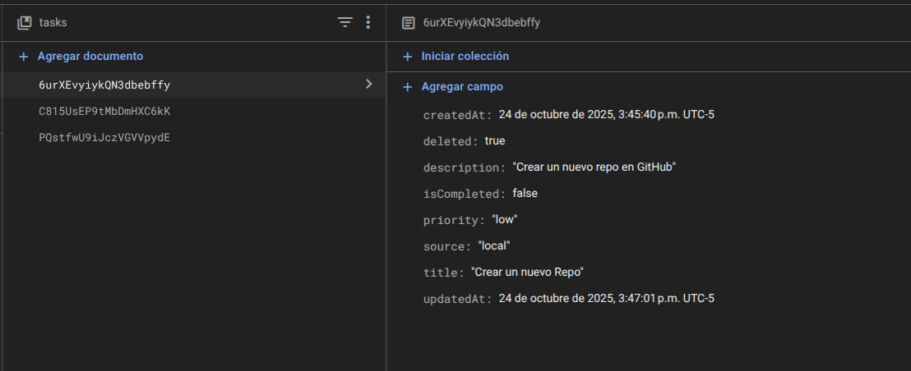

# TaskMaster Pro - Documentación Completa 📋🎮

Una aplicación híbrida de **gestión de tareas y Pokédex** construida con Flutter, que demuestra arquitectura limpia, gestión de estado avanzada con Riverpod, y múltiples fuentes de datos (Firebase, GraphQL, SQLite).

---

## 🌟 Visión General

**TaskMaster Pro** es una aplicación Flutter de **propósito dual**:

### 🎯 Propósito
- **Productividad**: Gestión completa de tareas personales con sincronización en la nube
- **Entretenimiento**: Exploración del universo Pokémon con datos en tiempo real

### ✨ Filosofía de Diseño
- **Arquitectura Limpia**: Separación estricta de capas (Presentation → Domain → Data)
- **Offline-First**: Funcionalidad completa sin conexión a internet
- **Multi-Source**: Combina Firebase, GraphQL y SQLite de manera transparente
- **User-Centric**: Experiencia fluida con múltiples opciones de acceso

---

## 📋 Feature 1: Sistema de Tareas

### 🎯 Descripción

Sistema completo de gestión de tareas con **sincronización en la nube**, **modo offline** y **migración sin pérdida de datos**.

---

### 🔐 Sistema de Autenticación Flexible

La aplicación ofrece **tres formas de acceso**:

#### 1️⃣ Modo Invitado (Sin cuenta)
```
✅ Acceso instantáneo sin registro
✅ Todas las tareas se guardan localmente (SQLite)
✅ Perfecto para probar la aplicación
✅ Posibilidad de vincular cuenta posteriormente
```

#### 2️⃣ Registro de Nueva Cuenta
```
📧 Crear cuenta con email y contraseña
☁️ Sincronización automática con Firebase
🔄 Datos guardados en Firestore
📱 Acceso desde cualquier dispositivo
```

#### 3️⃣ Inicio de Sesión
```
📧 Login con cuenta existente
⬇️ Descarga automática de tareas desde Firebase
🔄 Sincronización bidireccional en tiempo real
```

---

### 🔄 Flujos de Usuario

#### Flujo 1: Usuario Invitado → Cuenta en la Nube

```
┌─────────────────────────────────────────────────┐
│  1. Inicio como Invitado                        │
│     • UUID local generado: abc-123              │
│     • Sin autenticación Firebase                │
└──────────────────┬──────────────────────────────┘
                   │
┌──────────────────▼──────────────────────────────┐
│  2. Crea 5 tareas localmente                    │
│     • Guardadas en SQLite                       │
│     • Funcionamiento 100% offline               │
└──────────────────┬──────────────────────────────┘
                   │
┌──────────────────▼──────────────────────────────┐
│  3. Decide vincular cuenta                      │
│     • Perfil → "Vincular cuenta con la nube"    │
│     • Ingresa email y contraseña                │
└──────────────────┬──────────────────────────────┘
                   │
┌──────────────────▼──────────────────────────────┐
│  4. Migración automática                        │
│     • Firebase Auth crea cuenta                 │
│     • Genera firebaseUid: xyz-789               │
│     • Lee las 5 tareas de SQLite                │
│     • Sube cada tarea a Firestore               │
│     • Actualiza userId en SQLite                │
│     • Marca tareas como sincronizadas           │
└──────────────────┬──────────────────────────────┘
                   │
┌──────────────────▼──────────────────────────────┐
│  5. Usuario ahora autenticado                   │
│     • Sincronización automática habilitada      │
│     • ¡Cero pérdida de datos!                   │
└─────────────────────────────────────────────────┘
```

**🎯 Ventaja clave**: No pierdes ninguna tarea creada en modo invitado.

---

### 💾 Estrategia Offline-First

La aplicación garantiza **rendimiento instantáneo** y **disponibilidad sin conexión**:

#### Flujo de Creación de Tarea

```
Usuario crea tarea "Comprar leche"
          ↓
┌─────────────────────────────────────────┐
│  1. GUARDAR EN SQLite INMEDIATAMENTE    │  ⚡ < 50ms
│     • Tarea visible al instante         │
│     • Sin esperar red                   │
└──────────────────┬──────────────────────┘
                   │
        ┌──────────┴──────────┐
        │                     │
┌───────▼─────────┐  ┌────────▼────────┐
│  SI HAY RED     │  │  SIN RED        │
│  ✅ Subir a     │  │  ⏳ Quedará     │
│     Firebase    │  │     pendiente   │
│  ✅ Marcar como │  │  📱 Solo local  │
│     sincronizada│  │                 │
└─────────────────┘  └─────────────────┘
```

#### Sincronización Inteligente

```
┌──────────────────────────────────────────┐
│  TRIGGERS DE SINCRONIZACIÓN:             │
├──────────────────────────────────────────┤
│  ✅ Al crear tarea                       │
│  ✅ Al editar tarea                      │
│  ✅ Al completar/descompletar            │
│  ✅ Al eliminar tarea                    │
│  ✅ Al abrir la app (recupera cambios)   │
│  ✅ Botón manual (solo usuarios con auth)│
└──────────────────────────────────────────┘
```

#### Estados Visuales de Sincronización

```
☁️  SINCRONIZADO    → Guardado en Firebase
🔄  PENDIENTE       → Local, esperando subir
📱  SOLO LOCAL      → Usuario invitado
🌐  IMPORTADA       → Tarea desde API externa
```

---

### 🎨 Funcionalidades de Tareas

#### ✅ Operaciones CRUD

| Acción | Descripción | 
|--------|-------------|
| **Crear** | Nueva tarea con título, descripción y prioridad | - |
| **Leer** | Ver lista completa con filtros | - |
| **Editar** | Modificar cualquier campo | 
| **Eliminar** | Borrar con confirmación | - |
| **Completar** | Toggle completado/pendiente | - |

#### 🎯 Prioridades con Colores

```
🔴 ALTA      → Tareas urgentes e importantes
🟠 MEDIA     → Tareas importantes no urgentes
🟢 BAJA      → Tareas de baja prioridad
```

#### 🔍 Filtros Disponibles

```
┌───────────────────────────────┐
│  [ Todas ]  [Completadas]     │
│             [Pendientes]      │
└───────────────────────────────┘
```
---

### 🏗️ Arquitectura del Feature de Tareas

#### Estructura de Carpetas

```
lib/features/tasks/
├── data/
│   ├── datasources/
│   │   ├── task_local_datasource.dart      # SQLite operations
│   │   └── task_remote_datasource.dart     # Firebase Firestore
│   ├── models/
│   │   └── task_model.dart                 # DTO con mappers
│   └── repositories/
│       └── task_repository_impl.dart       # Implementación
│
├── domain/
│   ├── entities/
│   │   └── task.dart                       # Entidad de negocio
│   ├── repositories/
│   │   └── task_repository.dart            # Contrato abstracto
│   └── usecases/
│       ├── create_task_usecase.dart
│       ├── get_tasks_usecase.dart
│       ├── update_task_usecase.dart
│       ├── delete_task_usecase.dart
│       ├── toggle_complete_usecase.dart
│       └── sync_tasks_usecase.dart
│
└── presentation/
    ├── providers/
    │   ├── task_list_provider.dart         # Estado de lista
    │   ├── task_form_provider.dart         # Estado de formulario
    │   └── task_stats_provider.dart        # Estadísticas
    ├── screens/
    │   ├── task_list_screen.dart
    │   ├── task_detail_screen.dart
    │   └── task_form_screen.dart
    └── widgets/
        ├── task_card.dart
        ├── task_priority_badge.dart
        ├── sync_status_indicator.dart
        └── task_stats_card.dart
```

---

### 💾 Persistencia de Tareas

#### SQLite Local

```sql
CREATE TABLE tasks (
  id TEXT PRIMARY KEY,                    -- UUID v4
  firebase_id TEXT,                       -- ID en Firestore (null si no sincronizado)
  title TEXT NOT NULL,
  description TEXT,
  is_completed INTEGER DEFAULT 0,         -- 0 = false, 1 = true
  priority TEXT NOT NULL,                 -- 'high', 'medium', 'low'
  source TEXT DEFAULT 'user',             -- 'user', 'api'
  user_id TEXT NOT NULL,                  -- UUID local o Firebase UID
  is_synced INTEGER DEFAULT 0,            -- Estado de sincronización
  created_at TEXT NOT NULL,
  updated_at TEXT NOT NULL,
  FOREIGN KEY (user_id) REFERENCES users (id)
);
```

#### Firebase Firestore

```javascript
// Estructura en Firestore
users/{firebaseUid}/
├─ name: "Juan Pérez"
├─ email: "juan@example.com"
├─ createdAt: Timestamp
└─ tasks/{taskId}/
    ├─ title: "Comprar leche"
    ├─ description: "Leche deslactosada 1L"
    ├─ isCompleted: false
    ├─ priority: "high"
    ├─ source: "user"
    ├─ createdAt: Timestamp
    └─ updatedAt: Timestamp
```

---

### 📸 Evidencias en Firebase

#### 🔥 Firebase Authentication

La aplicación utiliza Firebase Authentication para gestionar usuarios de forma segura. Aquí se pueden ver los usuarios registrados con sus UIDs únicos.

**Captura: Firebase Authentication Console**



**Lo que se muestra:**
- ✅ Lista de usuarios registrados
- ✅ UIDs únicos de Firebase
- ✅ Emails verificados
- ✅ Fecha de creación de cuentas
- ✅ Fecha de último acceso

---

#### 📊 Firestore Database - Colección de Usuarios

La estructura de datos en Firestore sigue el patrón de usuarios como documentos principales.

**Captura: Colección `users` en Firestore**



**Estructura visible:**
```
users/
├── {firebaseUid1}/
│   ├── name: "Juan Pérez"
│   ├── email: "juan@example.com"
│   ├── createdAt: Timestamp
│   └── tasks/ (subcolección)
│
├── {firebaseUid2}/
│   ├── name: "María García"
│   ├── email: "maria@example.com"
│   ├── createdAt: Timestamp
│   └── tasks/ (subcolección)
```

---

#### 📋 Firestore Database - Subcolección de Tareas

Cada usuario tiene su propia subcolección de tareas, garantizando aislamiento de datos.

**Captura: Subcolección `tasks` dentro de un usuario**



**Estructura visible:**
```
users/{firebaseUid}/tasks/
├── {taskId1}/
│   ├── title: "Comprar leche"
│   ├── description: "Leche deslactosada 1L"
│   ├── isCompleted: false
│   ├── priority: "high"
│   ├── source: "user"
│   ├── createdAt: Timestamp
│   └── updatedAt: Timestamp
│
├── {taskId2}/
│   ├── title: "Reunión con cliente"
│   ├── description: "Presentar propuesta de proyecto"
│   ├── isCompleted: true
│   ├── priority: "medium"
│   ├── source: "user"
│   ├── createdAt: Timestamp
│   └── updatedAt: Timestamp
```

---

#### 📄 Detalle de Documento de Tarea

Vista detallada de un documento individual de tarea mostrando todos sus campos.

**Captura: Documento individual de tarea**



**Campos del documento:**

| Campo | Tipo | Descripción |
|-------|------|-------------|
| `title` | String | Título de la tarea |
| `description` | String | Descripción detallada (opcional) |
| `isCompleted` | Boolean | Estado de completado |
| `priority` | String | Prioridad: "low", "medium", "high" |
| `source` | String | Origen: "user" o "api" |
| `createdAt` | Timestamp | Fecha/hora de creación |
| `updatedAt` | Timestamp | Fecha/hora de última actualización |

---

#### 🔐 Verificación de Reglas de Seguridad

Las reglas de Firestore garantizan que:

```javascript
// ✅ Solo usuarios autenticados pueden acceder
// ✅ Cada usuario solo ve sus propios datos
// ✅ Validación de datos a nivel de servidor

rules_version = '2';
service cloud.firestore {
  match /databases/{database}/documents {
    match /users/{userId}/tasks/{taskId} {
      allow read, write: if request.auth != null 
                         && request.auth.uid == userId;
    }
  }
}
```

**Verificación visual en las capturas:**
- ✅ Los documentos están organizados por UID de usuario
- ✅ No hay acceso cruzado entre usuarios
- ✅ Todas las operaciones requieren autenticación
- ✅ Estructura jerárquica clara: `users/{uid}/tasks/{taskId}`

---

#### 💡 Beneficios de la Estructura en Firebase

| Beneficio | Descripción |
|-----------|-------------|
| **Escalabilidad** | Fácil agregar más usuarios y tareas sin límites |
| **Seguridad** | Aislamiento automático por usuario con reglas |
| **Performance** | Queries optimizadas por estructura jerárquica |
| **Mantenibilidad** | Estructura clara y predecible |
| **Backup** | Firebase maneja respaldos automáticos |
| **Tiempo Real** | Sincronización en tiempo real entre dispositivos |

---

### 🔒 Seguridad en Firebase

#### Reglas de Firestore

```javascript
rules_version = '2';
service cloud.firestore {
  match /databases/{database}/documents {
    
    // Solo usuarios autenticados
    match /users/{userId} {
      allow read, write: if request.auth != null 
                         && request.auth.uid == userId;
      
      // Tareas del usuario
      match /tasks/{taskId} {
        allow read, write: if request.auth != null 
                           && request.auth.uid == userId;
        
        // Validación de datos
        allow create: if request.resource.data.keys().hasAll([
          'title', 'isCompleted', 'priority', 'createdAt', 'updatedAt'
        ]);
      }
    }
  }
}
```

---

## 🎮 Feature 2: Pokédex Interactiva

### 🎯 Descripción

Explorador completo del universo Pokémon con datos en tiempo real desde **PokéAPI GraphQL**, sistema de **favoritos persistentes** y navegación fluida.

---

### ✨ Funcionalidades Principales

#### 1. 📱 Lista de Pokémon

```
┌─────────────────────────────────────────┐
│  Pokédex              🔍      ❤️ (12)   │ ← Búsqueda y contador
├─────────────────────────────────────────┤
│  ┌──────────┐  ┌──────────┐            │
│  │  #001    │  │  #002    │            │
│  │   🌱     │  │   🌱     │            │ ← Grid 2 columnas
│  │ Bulbasaur│  │ Ivysaur  │            │
│  │ [Planta] │  │ [Planta] │            │
│  │    ❤️    │  │    ♡     │            │ ← Toggle favorito
│  └──────────┘  └──────────┘            │
│  ┌──────────┐  ┌──────────┐            │
│  │  #003    │  │  #004    │            │
│  │  🌱 🔥   │  │   🔥     │            │
│  │ Venusaur │  │Charmander│            │
│  │[Pla][Ven]│  │ [Fuego]  │            │
│  │    ❤️    │  │    ♡     │            │
│  └──────────┘  └──────────┘            │
│                                         │
│  ⏳ Cargando más Pokémon...             │ ← Scroll infinito
└─────────────────────────────────────────┘
```

**Características**:
- ✅ Grid responsivo de 2 columnas
- ✅ Scroll infinito (paginación de 20 en 20)
- ✅ Pull to refresh
- ✅ Badge contador de favoritos
- ✅ Animación Hero en imágenes
- ✅ Estados: loading, error, vacío

---

#### 2. 🔍 Búsqueda en Tiempo Real

```
Usuario escribe: "pika"
        ↓
GraphQL Query: {
  pokemon_v2_pokemon(
    where: {name: {_ilike: "%pika%"}}
    limit: 20
  ) { ... }
}
        ↓
Resultados:
┌─────────────────────────────────────────┐
│  [Buscar Pokémon...____]         ✕     │
├─────────────────────────────────────────┤
│  Resultados para "pika":                │
│                                         │
│  ┌──────────┐  ┌──────────┐            │
│  │  #025    │  │  #026    │            │
│  │   ⚡     │  │   ⚡     │            │
│  │ Pikachu  │  │ Raichu   │            │
│  │[Eléctrico│  │[Eléctrico│            │
│  └──────────┘  └──────────┘            │
└─────────────────────────────────────────┘
```

**Características**:
- ✅ Case-insensitive
- ✅ Búsqueda por nombre
- ✅ Resultados instantáneos
- ✅ Query optimizado a GraphQL

---

#### 4. ⭐ Sistema de Favoritos

##### Flujo de Toggle Favorito

```
Usuario tap en ❤️ (Pikachu)
         ↓
┌────────┴─────────┐
│  ¿Es favorito?   │
└────────┬─────────┘
         │
    ┌────┴────┐
    │         │
┌───▼────┐ ┌─▼──────┐
│  SÍ    │ │  NO    │
│        │ │        │
│ DELETE │ │ INSERT │
│ SQLite │ │ SQLite │
│   ↓    │ │   ↓    │
│  UI:♡  │ │  UI:❤️ │
└────────┘ └────────┘
         │
┌────────▼─────────┐
│ Invalidar        │
│ Providers:       │
│ • pokemonList    │
│ • pokemonDetail  │
│ • favorites      │
│ • favoritesCount │
└──────────────────┘
```

##### Base de Datos de Favoritos

```sql
CREATE TABLE favorite_pokemon (
  id INTEGER PRIMARY KEY,               -- ID del Pokémon (1-1010)
  name TEXT NOT NULL,
  image_url TEXT,
  types TEXT NOT NULL,                  -- CSV: "fire,flying"
  height INTEGER,                       -- Decímetros
  weight INTEGER,                       -- Hectogramos
  abilities TEXT,                       -- JSON
  stats TEXT,                           -- JSON
  user_id TEXT NOT NULL,                -- ID del usuario actual
  added_at TEXT NOT NULL,               -- ISO timestamp
  FOREIGN KEY (user_id) REFERENCES users (id)
);
```

---

### 🏗️ Arquitectura del Feature de Pokémon

#### Estructura de Carpetas

```
lib/features/pokemon/
├── data/
│   ├── datasources/
│   │   ├── pokemon_local_datasource.dart     # SQLite (favoritos)
│   │   └── pokemon_remote_datasource.dart    # GraphQL API
│   ├── models/
│   │   ├── pokemon_model.dart
│   │   ├── pokemon_ability_model.dart
│   │   └── pokemon_stat_model.dart
│   ├── enums/
│   │   └── pokemon_type.dart                 # Tipos + colores oficiales
│   └── repositories/
│       └── pokemon_repository_impl.dart
│
├── domain/
│   ├── entities/
│   │   ├── pokemon.dart
│   │   ├── pokemon_ability.dart
│   │   └── pokemon_stat.dart
│   ├── repositories/
│   │   └── pokemon_repository.dart
│   └── usecases/
│       ├── get_pokemon_list_usecase.dart
│       ├── get_pokemon_by_id_usecase.dart
│       ├── search_pokemon_usecase.dart
│       ├── get_favorite_pokemon_usecase.dart
│       ├── add_to_favorites_usecase.dart
│       ├── remove_from_favorites_usecase.dart
│       ├── toggle_favorite_usecase.dart
│       └── get_favorites_count_usecase.dart
│
└── presentation/
    ├── providers/
    │   ├── pokemon_dependencies_provider.dart  # DI Container
    │   ├── pokemon_usecases_provider.dart      # Use Cases DI
    │   ├── pokemon_list_provider.dart          # Estado lista
    │   ├── pokemon_detail_provider.dart        # Estado detalle
    │   ├── favorite_pokemon_provider.dart      # Estado favoritos
    │   ├── search_pokemon_provider.dart        # Estado búsqueda
    │   └── controllers/
    │       └── toggle_favorite_controller.dart
    ├── screens/
    │   ├── pokemon_list_screen.dart
    │   ├── pokemon_detail_screen.dart
    │   └── favorite_pokemon_screen.dart
    └── widgets/
        ├── pokemon_card.dart
        ├── pokemon_type_badge.dart
        ├── pokemon_stat_bar.dart
        ├── pokemon_empty_state.dart
        ├── pokemon_loading_shimmer.dart
        └── pokemon_error_widget.dart
```

---

### 🔌 Integración con PokéAPI GraphQL

#### Endpoint

```
https://beta.pokeapi.co/graphql/v1beta
```

#### Query de Lista con Paginación

```graphql
query GetPokemonList($limit: Int!, $offset: Int!) {
  pokemon_v2_pokemon(
    limit: $limit
    offset: $offset
    order_by: { id: asc }
  ) {
    id
    name
    height
    weight
    pokemon_v2_pokemonsprites {
      sprites
    }
    pokemon_v2_pokemontypes {
      pokemon_v2_type {
        name
      }
    }
    pokemon_v2_pokemonabilities {
      is_hidden
      pokemon_v2_ability {
        name
      }
    }
    pokemon_v2_pokemonstats {
      base_stat
      pokemon_v2_stat {
        name
      }
    }
  }
}
```

#### Query de Búsqueda

```graphql
query SearchPokemon($query: String!) {
  pokemon_v2_pokemon(
    where: { name: { _ilike: $query } }
    limit: 20
  ) {
    id
    name
    # ... mismos campos que lista
  }
}
```

#### Query de Detalle

```graphql
query GetPokemonDetail($id: Int!) {
  pokemon_v2_pokemon_by_pk(id: $id) {
    id
    name
    height
    weight
    # ... campos completos
  }
}
```


---

## 🔗 Integración Entre Features

### Compartiendo Infraestructura

Ambos features comparten:

#### 1. Sistema de Usuarios

```dart
// Usuario puede tener:
// - Tareas (sincronizadas con Firebase)
// - Pokémon favoritos (solo local en SQLite)

class User {
  final String id;              // UUID local o Firebase UID
  final String? firebaseId;     // UID de Firebase Auth (null si invitado)
  final String? name;
  final String? email;
  final bool isGuest;           // true si es modo invitado
  final DateTime createdAt;
}
```

#### 2. Base de Datos SQLite Compartida

```sql
-- Una sola base de datos con múltiples tablas

-- Tabla de usuarios
CREATE TABLE users (
  id TEXT PRIMARY KEY,
  firebase_id TEXT UNIQUE,
  name TEXT,
  email TEXT,
  is_guest INTEGER DEFAULT 0,
  created_at TEXT NOT NULL
);

-- Tabla de tareas
CREATE TABLE tasks (
  id TEXT PRIMARY KEY,
  firebase_id TEXT,
  user_id TEXT NOT NULL,
  title TEXT NOT NULL,
  -- ... más campos
  FOREIGN KEY (user_id) REFERENCES users (id)
);

-- Tabla de Pokémon favoritos
CREATE TABLE favorite_pokemon (
  id INTEGER PRIMARY KEY,
  user_id TEXT NOT NULL,
  name TEXT NOT NULL,
  -- ... más campos
  FOREIGN KEY (user_id) REFERENCES users (id)
);
```

#### 3. Providers Compartidos

```dart
// providers/core/

@riverpod
DatabaseHelper databaseHelper(DatabaseHelperRef ref) {
  return DatabaseHelper.instance; // Singleton
}

@riverpod
Stream<User?> currentUser(CurrentUserRef ref) {
  // Escucha cambios del usuario actual
  return ref.watch(authRepositoryProvider).currentUserStream;
}

@riverpod
String? currentUserId(CurrentUserIdRef ref) {
  final user = ref.watch(currentUserProvider).value;
  return user?.id;
}
```

---

### Flujo de Datos Compartido

```
┌─────────────────────────────────────────────────────┐
│               AUTHENTICATION STATE                  │
│                                                     │
│  ┌─────────────────────────────────────────┐        │
│  │  authStateProvider                      │        │
│  │  • Usuario actual                       │        │   
│  │  • Estado de autenticación              │        │  
│  └──────────────┬──────────────────────────┘        │
└─────────────────┼───────────────────────────────────┘
                  │
        ┌─────────┴──────────┐
        │                    │
┌───────▼──────────┐  ┌──────▼──────────┐
│  FEATURE TAREAS  │  │ FEATURE POKÉMON │
│                  │  │                 │
│  taskListProvider│  │ pokemonList     │
│  (userId)        │  │ Provider        │
│                  │  │ (userId)        │
│  ↓               │  │ ↓               │
│  Consulta tareas │  │ Consulta        │
│  del userId      │  │ favoritos       │
│                  │  │ del userId      │
└──────────────────┘  └─────────────────┘
```

---

## 🔧 Stack Tecnológico

### Gestión de Estado

```yaml
flutter_riverpod: ^2.4.0           # Base de Riverpod
riverpod_annotation: ^2.3.0        # Annotations para code gen
riverpod_generator: ^2.3.0         # Generador de código
```

**Ventajas de Riverpod**:
- ✅ Type-safe completamente
- ✅ Compile-time safety
- ✅ Auto-dispose de recursos
- ✅ Invalidación selectiva de caché
- ✅ Testing-friendly
- ✅ Sin BuildContext necesario

---

### Modelos Inmutables

```yaml
freezed: ^2.4.5                    # Union types + immutability
freezed_annotation: ^2.4.1
json_serializable: ^6.7.1          # JSON serialization
```

---

### Networking

```yaml
# Firebase
firebase_core: ^2.24.0
firebase_auth: ^4.15.0
cloud_firestore: ^4.13.0

# GraphQL
graphql_flutter: ^5.1.2
```

---

### Almacenamiento Local

```yaml
sqflite: ^2.3.0                    # SQLite database
shared_preferences: ^2.2.2         # Key-value storage
```

---

### UI y Diseño

```yaml
# Imágenes
cached_network_image: ^3.3.0       # Caché de imágenes
shimmer: ^3.0.0                    # Loading placeholders

# Fuentes e íconos
google_fonts: ^6.1.0
lucide_icons_flutter: ^1.0.0

# Navegación
go_router: ^13.0.0                 # Routing declarativo
```

---

### Utilidades

```yaml
dartz: ^0.10.1                     # Functional programming (Either)
uuid: ^4.0.0                       # Generación de UUIDs
intl: ^0.18.0                      # Internacionalización
equatable: ^2.0.5                  # Comparación de objetos
```

---

### Code Generation

```yaml
build_runner: ^2.4.7               # Ejecuta generadores
```

**Comandos**:

```bash
# Generar código (una vez)
flutter pub run build_runner build --delete-conflicting-outputs

# Watch mode (desarrollo)
flutter pub run build_runner watch --delete-conflicting-outputs
```

---

## 📁 Estructura del Proyecto

```
lib/
├── core/                           # Código compartido
│   ├── database/
│   │   └── database_helper.dart    # Singleton de SQLite
│   ├── errors/
│   │   ├── failures.dart           # Tipos de errores
│   │   └── exceptions.dart         # Excepciones
│   ├── network/
│   │   ├── graphql_client.dart     # Cliente GraphQL
│   │   └── network_info.dart       # Conectividad
│   ├── utils/
│   │   ├── constants.dart
│   │   ├── extensions.dart
│   │   └── validators.dart
│   └── providers/
│       ├── database_provider.dart
│       └── auth_provider.dart
│
├── features/
│   ├── auth/                       # Autenticación
│   │   ├── data/
│   │   ├── domain/
│   │   └── presentation/
│   │
│   ├── tasks/                      # Feature de Tareas
│   │   ├── data/
│   │   │   ├── datasources/
│   │   │   ├── models/
│   │   │   └── repositories/
│   │   ├── domain/
│   │   │   ├── entities/
│   │   │   ├── repositories/
│   │   │   └── usecases/
│   │   └── presentation/
│   │       ├── providers/
│   │       ├── screens/
│   │       └── widgets/
│   │
│   └── pokemon/                    # Feature de Pokémon
│       ├── data/
│       │   ├── datasources/
│       │   ├── models/
│       │   ├── enums/
│       │   └── repositories/
│       ├── domain/
│       │   ├── entities/
│       │   ├── repositories/
│       │   └── usecases/
│       └── presentation/
│           ├── providers/
│           ├── screens/
│           └── widgets/
│
├── config/
│   ├── routes/
│   │   └── app_router.dart         # go_router config
│   ├── theme/
│   │   └── app_theme.dart          # Tema de la app
│   └── env/
│       └── env_config.dart         # Variables de entorno
│
└── main.dart                       # Entry point
```

---

## 🧭 Navegación y Routing

### go_router Configuration

```dart
final appRouter = GoRouter(
  initialLocation: '/splash',
  routes: [
    GoRoute(
      path: '/splash',
      builder: (context, state) => const SplashScreen(),
    ),
    GoRoute(
      path: '/welcome',
      builder: (context, state) => const WelcomeScreen(),
    ),
    GoRoute(
      path: '/login',
      builder: (context, state) => const LoginScreen(),
    ),
    GoRoute(
      path: '/register',
      builder: (context, state) => const RegisterScreen(),
    ),
    GoRoute(
      path: '/home',
      builder: (context, state) => const HomeScreen(),
    ),
  redirect: (context, state) {
    final authState = ref.read(authStateProvider);
    if (authState.isLoading) {
      return '/splash';
    }
    final isLoggedIn = authState.value != null;
    final isGoingToAuth = state.location.startsWith('/login') ||
                          state.location.startsWith('/register') ||
                          state.location.startsWith('/welcome');
    if (!isLoggedIn && !isGoingToAuth) {
      return '/welcome';
    }
    if (isLoggedIn && isGoingToAuth) {
      return '/home';
    }
    return null;
  },
);
```

---

## 🚀 Roadmap y Mejoras

### Feature de Tareas - Mejoras Futuras

#### 1. Categorías de Tareas
```
✅ Trabajo
✅ Personal
✅ Compras
✅ Salud
✅ Educación
```

#### 2. Recordatorios
```
⏰ Notificaciones locales
📅 Integración con calendario
🔔 Recordatorios recurrentes
```

#### 3. Etiquetas (Tags)
```
#urgente #trabajo #casa
Filtrado por múltiples etiquetas
```

#### 4. Subtareas
```
Tarea Principal
  ├─ Subtarea 1 ✓
  ├─ Subtarea 2 ⏳
  └─ Subtarea 3 ⏳
Progreso: 33%
```

#### 5. Compartir Tareas
```
👥 Tareas colaborativas
📧 Invitar por email
🔄 Sincronización en tiempo real
```

---

### Feature de Pokémon - Mejoras Futuras

#### 1. Filtros Avanzados
```
🔍 Por tipo (Fuego, Agua, etc.)
📊 Por estadísticas
🎮 Por generación (I-IX)
⚡ Por habilidades
```

#### 2. Comparador
```
┌──────────┬──────────┐
│ Pikachu  │ Raichu   │
├──────────┼──────────┤
│ ATK: 55  │ ATK: 90  │
│ DEF: 40  │ DEF: 55  │
│ SPD: 90  │ SPD: 110 │
└──────────┴──────────┘
```

#### 3. Evoluciones
```
Bulbasaur → Ivysaur → Venusaur
  Nivel 16    Nivel 32
```

#### 4. Movimientos
```
Nivel 1:  Placaje, Gruñido
Nivel 5:  Látigo Cepa
Nivel 9:  Hoja Afilada
MT/MO:    Solar Beam, Sludge Bomb
```


#### 5. Modo Offline Completo
```
📦 Descargar Pokédex completa
🖼️ Caché de imágenes
🔍 Búsqueda local sin red
```

#### 6. Estadísticas de Usuario
```
📈 35 Pokémon vistos
⭐ 12 Pokémon favoritos
🔍 125 búsquedas realizadas
⏱️ 2.5 horas en la app
🎯 Tipo favorito: Fuego
```

---


#### Internacionalización
```
🌍 Inglés (EN)
🌎 Español (ES)
🌏 Portugués (PT)
🗾 Japonés (JA)
```

---

## 📄 Conclusión

**TaskMaster Pro** es más que una app de tareas o una Pokédex: es una **demostración completa de arquitectura de software moderna** que combina:

### ✅ Aspectos Técnicos
- Clean Architecture implementada correctamente
- Gestión de estado avanzada con Riverpod
- Múltiples fuentes de datos (Firebase, GraphQL, SQLite)
- Offline-first con sincronización inteligente
- Code generation para type-safety
- Testing comprehensivo

### ✅ Experiencia de Usuario
- Acceso flexible (invitado, registro, login)
- Funcionamiento offline completo
- Migración sin pérdida de datos
- Sincronización transparente
- Interfaz intuitiva y fluida

### ✅ Buenas Prácticas
- SOLID principles
- Separation of Concerns
- Dependency Injection
- Error handling robusto
- Seguridad implementada correctamente

### ✅ Escalabilidad
- Estructura modular por features
- Fácil agregar nuevas funcionalidades
- Código mantenible y testeable
- Preparado para crecimiento

---

## 🙏 Créditos

### APIs y Servicios
- **Firebase**: Backend-as-a-Service
- **PokéAPI**: https://pokeapi.co/
- **GraphQL Beta**: https://beta.pokeapi.co/graphql/v1beta

### Tecnologías
- **Flutter**: Framework de UI
- **Riverpod**: Estado reactivo
- **Freezed**: Modelos inmutables
- **Dartz**: Programación funcional

### Recursos
- **Sprites Pokémon**: The Pokémon Company
- **Colores de tipos**: Basados en juegos oficiales

---

**Última actualización**: Octubre 2025  
**Versión**: 1.0.0  
**Desarrollado con**: Flutter 3.x + Dart 3.x

---

*Desarrollado con ❤️ y atención al detalle, aplicando las mejores prácticas de desarrollo de software.*